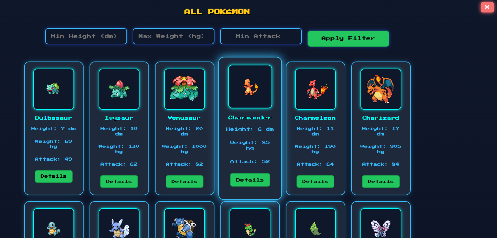
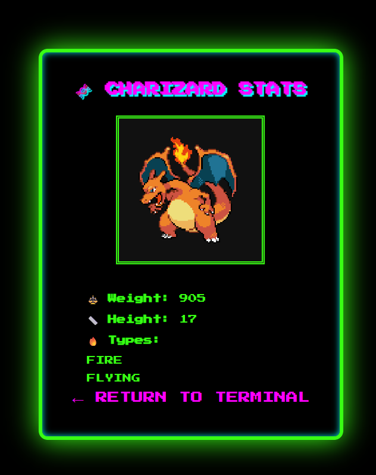
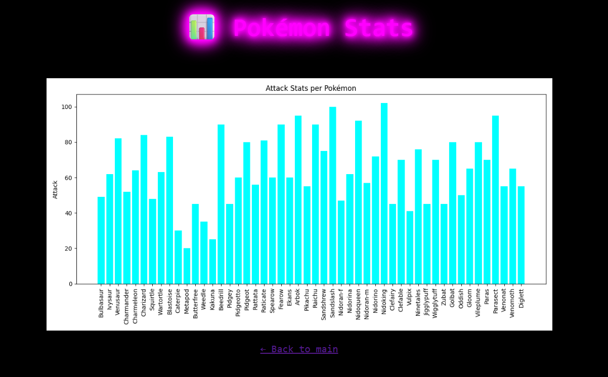

# PokéDex Viewer – Flaskbaserad Web App

Detta projekt är en enkel men kraftfull webbapplikation som låter användaren söka och filtrera Pokémon med hjälp av ett externt API (PokeAPI). Användaren kan skriva in ett namn, filtrera baserat på attribut (t.ex. attack, vikt, längd) och visa en lista med kort för varje Pokémon. Projektet är helt byggt i Python med Flask som backend-ramverk.

---

## 🧩 Funktioner

- Sök Pokémon med namn
- Visa längd, vikt och attack
- Filtrera Pokémon efter:
  - Minsta längd
  - Maxvikt
  - Min attackstyrka
- Dynamisk statistikgraf för attackvärden
- Använder PokeAPI som extern datakälla
- Mobilanpassad och pixelinspirerad design
- Visar alla Pokémon som kort (grid view)
- Realtidsfiltrering via JavaScript
- Visualisering med Matplotlib
- Caching av data för bättre prestanda
- Grundläggande säkerhetsåtgärder (ratelimit, headers, input-skydd)

---

## 🛠 Använda tekniker

| Teknik         | Beskrivning |
|----------------|-------------|
| **Flask**      | Webbramverk i Python som hanterar routing, rendering och logik |
| **Requests**   | Hämtar JSON-data från PokeAPI |
| **Matplotlib** | Används för att skapa stapeldiagram för attack-statistik |
| **HTML + Jinja2** | Dynamisk rendering av sidor |
| **CSS**        | Anpassad layout, responsiv och retro-spelinspirerad |
| **JavaScript** | Realtidsfiltrering av korten direkt i browsern |
| **JSON**       | Strukturen på datan från API:et |
| **ThreadPoolExecutor** | Snabbar upp API-anrop vid parallell hämtning av Pokémon |
| **tkinter (headless)** | Visualisering renderas utan fönster |
| **Security Middleware** | Anpassad modul för säkerhet (ratelimit, headers, inputvalidering)

---

## 🔐 Säkerhet

Projektet innehåller en **dedikerad säkerhetsmodul (`security.py`)** som implementerar:

- **Rate Limiting:** Begränsar varje IP till 40 requests per minut
- **Inputsanering:** Rensar bort potentiellt farlig input
- **HTTP Headers:** Lägger till säkra HTTP-responshuvuden, t.ex. Content-Security-Policy, X-Frame-Options och Referrer-Policy
- **Cache-prevention:** Inaktiverar cache för känsliga sidor

Integrationen sker automatiskt genom `@rate_limit()` på varje route samt via `@app.after_request` som applicerar headers globalt.

---

## Installation och körning

1. Klona projektet:
- git clone https://github.com/AryaEisa/pokemon_APIintegration_flask.git

## Kontakt

Skapad av Arya Pour Eisa  
Mejla mig via: **arya@aryaeisa.com**  
Portfolio: [aryaeisa.com](https://aryaeisa.com)

---