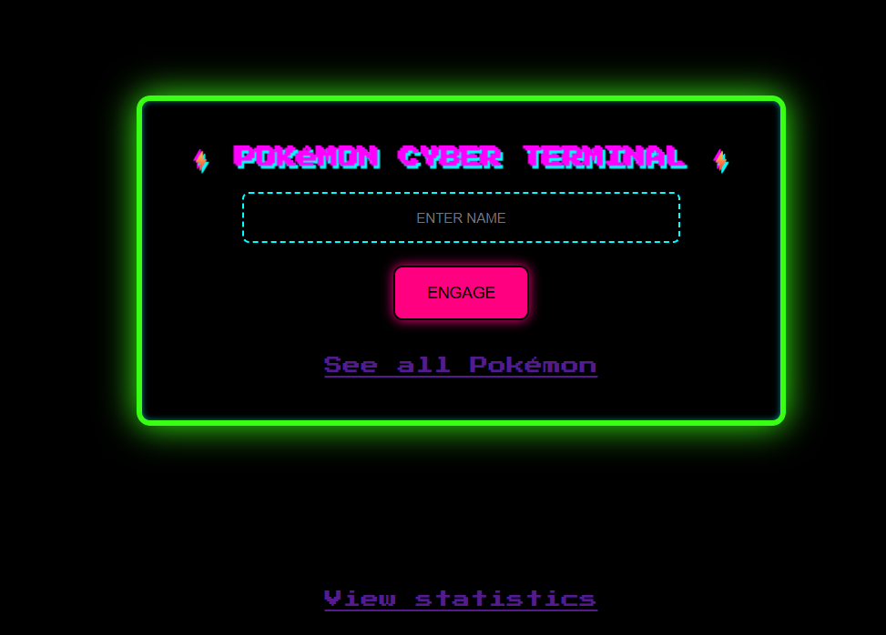

# PokéDex Viewer – Flaskbaserad Web App

Detta projekt är en enkel men kraftfull webbapplikation som låter användaren söka och filtrera Pokémon med hjälp av ett externt API (PokeAPI). Användaren kan skriva in ett namn, filtrera baserat på attribut (t.ex. attack, vikt, längd) och visa en lista med kort för varje Pokémon. Projektet är helt byggt i Python med Flask som backend-ramverk.

---

## 🧩 Funktioner

- 🔍 Sök Pokémon med namn
- 📏 Visa längd, vikt och attack
- 🧮 Filtrera Pokémon efter:
  - Minsta längd
  - Maxvikt
  - Min attackstyrka
- 📊 Dynamisk statistikgraf för attackvärden
- 💾 Använder PokeAPI som extern datakälla
- 🎨 Mobilanpassad och pixelinspirerad design
- ⚡ Visar alla Pokémon som kort (grid view)
- 🧠 Realtidsfiltrering via JavaScript
- 🖼️ Visualisering med Matplotlib

---

## 🛠 Använda tekniker

| Teknik         | Beskrivning |
|----------------|-------------|
| **Flask**      | Webbramverk i Python som hanterar routing, rendering och logik |
| **Requests**   | Hämtar JSON-data från PokeAPI |
| **Matplotlib** | Används för att skapa stapeldiagram för attack-statistik |
| **HTML + Jinja2** | Dynamisk rendering av sidor |
| **CSS**        | Anpassad layout, responsiv och retro-spelinspirerad |
| **JavaScript** | Realtidsfiltrering av korten direkt i browsern |
| **JSON**       | Strukturen på datan från API:et |

---

## Installation och körning

1. Klona projektet:
- git clone https://github.com/AryaEisa/pokemon_APIintegration_flask.git

## Kontakt

Skapad av Arya Pour Eisa  
Mejla mig via: **arya@aryaeisa.com**  
Portfolio: [aryaeisa.com](https://aryaeisa.com)

---